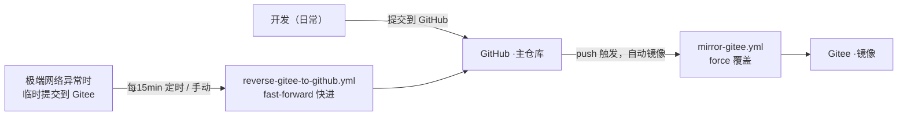

# 开发规范（Development Standards）

> 版本同步与提交约定。本文档定义本仓库的**主仓库 / 镜像仓库**协同方式及开发提交规范。

---

## 1. 仓库角色与同步架构

| 仓库 | 角色 | 用途 |
|---|---|---|
| **GitHub**（`flyme-baoabo/htmx-study-express-vite`） | **主仓库** | 日常开发、提交、发布 |
| **Gitee**（`gitee/flyme-baoabo/htmx-study-express-vite`） | **镜像/灾备** | GitHub 不可用时的临时提交地 |

### 两条同步链路

1. **正向同步（GitHub → Gitee）**：`git push` 到 GitHub 后，`Sync To Gitee`（`.github/workflows/mirror-gitee.yml`）自动把提交镜像到 Gitee。
   - 策略：`force_update` 强制覆盖，**以 GitHub 为准**。
   - 触发：`main` / `master` 分支的 `push` 事件。

2. **反向同步（Gitee → GitHub）**：`Sync Gitee To GitHub`（`.github/workflows/reverse-gitee-to-github.yml`）定期或手动把 Gitee 提交快进拉回 GitHub。
   - 策略：`fast-forward`（不带 force），GitHub 一旦领先即拒绝，**绝不覆盖 GitHub**。
   - 触发：`cron: "*/15 * * * *"`（每 15 分钟）+ 手动 `Run workflow`。

---

## 2. 提交约定（最重要 ⚠️）

> **禁止双端同时提交。**

日常开发只能往**一个**仓库提交，正常情况只提交 **GitHub**：

- ✅ **默认**：所有开发、提交、推送 → **GitHub**，同步自动完成。
- 🚨 **极端情况**：仅当无法访问 GitHub 时，才临时提交到 **Gitee**，随后靠反向同步拉回 GitHub。
- ❌ **禁止**：在同一时期/基于不同历史，同时向 GitHub 与 Gitee 提交。
  - 否则两仓库历史分叉，正向的 `force` 会覆盖 Gitee 侧提交、反向因非快进而拒绝，导致同步冲突与提交丢失。

### 何时用哪条链路

| 场景 | 该提交到 | 依靠的同步 |
|---|---|---|
| 能访问 GitHub | **GitHub** | 正向自动镜像到 Gitee |
| 无法访问 GitHub（极端网络） | **Gitee** | 反向定时 / 手动拉回 GitHub |
| 想立刻拉取 / 恢复一致性 | 手动触发 `Sync Gitee To GitHub` | 反向 |

---

## 3. 手动触发反向同步

在 GitHub 仓库 **Actions → Sync Gitee To GitHub → Run workflow** 即可立即执行一次反向同步，无需等待定时任务。

---

## 4. 新增同步时需要注意

- 新分支 / 新标签会自动被两条链路覆盖（正向 force / 反向 prune）。
- 若误在 Gitee 提交了内容，先手动触发反向同步拉回，**再**继续在 GitHub 上 push，避免被正向 `force` 覆盖丢失。

---

## 5. 相关文件

- `.github/workflows/mirror-gitee.yml` —— 正向同步（GitHub → Gitee）
- `.github/workflows/reverse-gitee-to-github.yml` —— 反向同步（Gitee → GitHub）
- 本文件：`docs/development-standards.md`