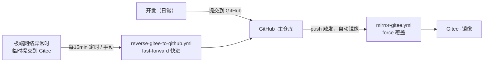

# 开发规范（Development Standards）

> 版本同步与提交约定。本文档定义本仓库的**主仓库 / 镜像仓库**协同方式及开发提交规范。

---

## 1. 仓库角色与同步架构

| 仓库 | 角色 | 用途 |
|---|---|---|
| **GitHub**（`flyme-baoabo/htmx-study-express-vite`） | **主仓库** | 日常开发、提交、发布 |
| **Gitee**（`gitee/flyme-baoabo/htmx-study-express-vite`） | **镜像/灾备** | GitHub 不可用时的临时提交地 |



### 两条同步链路

1. **正向同步（GitHub → Gitee）**：`git push` 到 GitHub 后，`Sync To Gitee`（`.github/workflows/mirror-gitee.yml`）自动把提交镜像到 Gitee。
   - 策略：`force_update` 强制覆盖，**以 GitHub 为准**。
   - 触发：`main` / `master` 分支的 `push` 事件。

2. **反向同步（Gitee → GitHub）**：`Sync Gitee To GitHub`（`.github/workflows/reverse-gitee-to-github.yml`）定期或手动把 Gitee 提交快进拉回 GitHub。
   - 策略：`fast-forward`（不带 force），GitHub 一旦领先即拒绝，**绝不覆盖 GitHub**。
   - 触发：`cron: "*/15 * * * *"`（每 15 分钟）+ 手动 `Run workflow`。

---

## 2. 提交约定（最重要 ⚠️）

> **禁止双端同时提交。**

日常开发只能往**一个**仓库提交，正常情况只提交 **GitHub**：

- ✅ **默认**：所有开发、提交、推送 → **GitHub**，同步自动完成。
- 🚨 **极端情况**：仅当无法访问 GitHub 时，才临时提交到 **Gitee**，随后靠反向同步拉回 GitHub。
- ❌ **禁止**：在同一时期/基于不同历史，同时向 GitHub 与 Gitee 提交。
  - 否则两仓库历史分叉，正向的 `force` 会覆盖 Gitee 侧提交、反向因非快进而拒绝，导致同步冲突与提交丢失。

### 何时用哪条链路

| 场景 | 该提交到 | 依靠的同步 |
|---|---|---|
| 能访问 GitHub | **GitHub** | 正向自动镜像到 Gitee |
| 无法访问 GitHub（极端网络） | **Gitee** | 反向定时 / 手动拉回 GitHub |
| 想立刻拉取 / 恢复一致性 | 手动触发 `Sync Gitee To GitHub` | 反向 |

---

## 3. 手动触发反向同步

在 GitHub 仓库 **Actions → Sync Gitee To GitHub → Run workflow** 即可立即执行一次反向同步，无需等待定时任务。

---

## 4. 新增同步时需要注意

- 新分支 / 新标签会自动被两条链路覆盖（正向 force / 反向 prune）。
- 若误在 Gitee 提交了内容，先手动触发反向同步拉回，**再**继续在 GitHub 上 push，避免被正向 `force` 覆盖丢失。

---

## 5. 相关文件

- `.github/workflows/mirror-gitee.yml` —— 正向同步（GitHub → Gitee）
- `.github/workflows/reverse-gitee-to-github.yml` —— 反向同步（Gitee → GitHub）
- 本文件：`docs/development-standards.md`

---

## 6. 渲染中间件（fragment.middleware / render.middleware）⚡

服务端采用 **express-ejs-layouts + 渲染中间件** 完成页面组装。三条铁律：**挂载顺序不能错**、**业务路由统一走 `res.renderPage`**、**局部片段走 `res.render('partials/…')`**。

### 6.1 职责分工

| 中间件 | 文件 | 职责 |
|---|---|---|
| `injectFragmentFlagMiddleware` | `server/src/middleware/fragment.middleware.ts` | 请求入口：解析 hx‑request / history‑restore 头，挂载 `req.isHXRequest / isHistoryRestore / isFragment`，并在 `res` 挂 `res.isFragmentRequest(view)` 预判方法 |
| `fragmentRenderMiddleware` | 同上 | 重写 `res.render`：当 `res.isFragmentRequest(view)` 为真且用户未显式传 `layout` 时，自动注入 `layout=false`（返回可被 htmx 替换的纯片段）；其余原样交还 |
| `protectPartialsRoute` | 同上 | 挂在 `/partials/*`，**禁止浏览器直接访问**片段接口：非 htmx 请求直接 `403` |
| `renderPageMiddleware` | `server/src/middleware/render.middleware.ts` | 在 `res` 上挂载 `res.renderPage(view, options)`，按 `layouts` 数组**由内向外**组装多层布局外壳 |

> 转发时 `res.render` 已被 express-layouts 包装，需用 `bind` 保留 `this === res`（内部依赖 `this.req.app`），避免 TypeError。

### 6.2 挂载顺序（不可颠倒）

```ts
app.use(injectFragmentMiddleware);          // ① 先注入 htmx 标记，供后续判定在 req 上取标记
app.use(fragmentMiddleware);               // ② 重写 res.render：isFragment 命中时自动 layout:false
app.use('/partials/*', protectPartialsRoute); // ③ 保护碎片接口
app.use(renderPageMiddleware);            // ④ 后挂 res.renderPage
```

`renderPageMiddleware` 内部调用的 `res.render` 就是 **② 挂载过的那同一个分发函数**，只是视图名不同走不同分支。顺序颠倒会导致互相覆盖、局部片段被错误套壳，或保护路由读不到标记。

### 6.3 `res.renderPage` 的嵌套组装

`res.renderPage` 由内向外执行，`layouts` 数组决定外壳套几层（缺省退化为单层 `app-layout`）：

1. **第一层**：渲染内容视图本体，`layout:false` 拿到纯 html 字符串（回调）；
2. **中间层**：逐个套上 `layouts` 里的外壳模板，都拿到字符串继续拼装；
3. **最外层**：`res.render` 直接输出，`layout` 取 `outerFlag ? 'layouts/layout' : false`（传入 callback 监错并经 `next` 抛出）。

| 场景 | 内容 -> | 外壳 -> | 外层布局 |
|---|---|---|---|
| 整页（缺省 `pageLayout` 即 true） | 内容视图（`index` / `listPage`…） | `app-layout.ejs`（注入 `outletContent`） | 套 `layouts/layout`（全局 body 骨架） |
| 片段（`pageLayout:false`，供 htmx `/body` 整块替换 `#root`） | 内容视图 | `app-layout.ejs` | 不套（`layout:false`） |

`outerFlag = useOuterEjsLayout ?? pageLayout ?? true`（`useOuterEjsLayout` > `pageLayout` > 默认 `true`）。

- **新增页面**：只要加一个内容视图（如 `listPage.ejs`）并在 `PAGE_META` 登记，无需改中间件。
- **业务路由禁止手写 `layout:false` / 手动换壳** —— 一律用 `res.renderPage`。

### 6.4 用哪个渲染 API（`renderPage` vs `res.render`）⚡

**核心判据：返回的响应里要不要带 app-layout 外壳（header + `#outlet` + footer）。**

| 场景 | 用 | 为什么 |
|---|---|---|
| 整页（首屏 / 整页导航，如 `pages.js`） | `res.renderPage(meta.view, {...})` | 需要完整页面 = 内容 + app-layout + layout |
| 语言切换 `/body`（`locale.js`） | `res.renderPage(..., { pageLayout:false })` | 前端要整块替换 `#root`，而 `#root` 内正是「app-layout 外壳 + 内容」——**需要带壳**，但不要 `layout`（`<html>/<head>/<body>` 那层） |
| 局部片段（待办增删改，`partials/item`、`partials/list`） | `res.render('partials/…', ...)` | 只要一个列表元素，不沾外壳；fragment 会**自动注入 `layout:false` 绕开布局** |

**例外的直觉纠偏 —— 为什么 `/body` 是 `renderPage` 而不是 `res.render`？**

不是因为「它是语言切换」，而是因为它要替换整个 `#root`，而 `#root` 里装的正是 `app-layout` 外壳（header + `#outlet` + footer）。若用 `res.render('index', {layout:false})` 只会得到纯内容，替换后 header/footer 都会消失。所以它必须走 `renderPage` 组装出「内容 + app-layout 外壳」，再靠 `pageLayout:false` 切掉最外层 `layout`。语言切换只是触发时机，不是用 `renderPage` 的根因。

**一句话记法：**
- 要 **app-layout 外壳**（整页或带壳重绘）→ `renderPage`
- 只要 **局部列表元素** → `res.render('partials/…')`